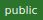
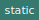

# Module `paintingActions`


Actions for scope painting.&lt;ul&gt;&lt;li&gt;Redux Functionality&lt;/li&gt;&lt;li&gt;Redux Actions have a prefixed scope (painting)&lt;/li&gt;&lt;/ul&gt;

[Source file](../src/actions/painting.js)

## Constants

### `ADD_PAINTING`

 


#### Value

```javascript
'ADD_PAINTING'
```

---

### `REMOVE_PAINTING`

 


#### Value

```javascript
'REMOVE_PAINTING'
```

---

### `SHARE_PAINTING`

 


#### Value

```javascript
'SHARE_PAINTING'
```

---

### `OPEN_PAINTING`

 


#### Value

```javascript
'OPEN_PAINTING'
```

---

### `RECEIVE_PAINTING`

 


#### Value

```javascript
'RECEIVE_PAINTING'
```

---

### `TRIGGER`

 


#### Value

```javascript
'TRIGGER'
```

---

### `INITIAL_DATA_LOAD`

 


#### Value

```javascript
'INITIAL_DATA_LOAD'
```

---

### `UNSELECT_PAINTING`

 


#### Value

```javascript
'UNSELECT_PAINTING'
```

---

### `addPainting`

 

Action to create a new painting.
Dispatches an openPainting action.&lt;ul&gt;&lt;li&gt;Redux Functionality&lt;/li&gt;&lt;/ul&gt;

Parameters | Type | Description
--- | --- | ---
__*return*__ | `Redux.AsyncAction` | **

#### Value

```javascript
() => (dispatch) => {
  const painting = new Painting();
  dispatch({
    type: ADD_PAINTING,
    painting,
  });
  dispatch(openPainting(painting.id));
}
```

---

### `receivePainting`

 

Action to load a painting into the state.&lt;ul&gt;&lt;li&gt;Redux Functionality&lt;/li&gt;&lt;/ul&gt;

Parameters | Type | Description
--- | --- | ---
__paintingId__ | `number` | **
__*return*__ | `Redux.AsyncAction` | **

#### Value

```javascript
(paintingId) => async (dispatch) => {
  const db = await database();
  const painting = await db.paintings.get(parseInt(paintingId));
  dispatch({
    type: RECEIVE_PAINTING,
    paintingId,
    painting,
  });
}
```

---

### `openPainting`

 

Action to open a painting into the state.&lt;ul&gt;&lt;li&gt;Redux Functionality&lt;/li&gt;&lt;/ul&gt;

Parameters | Type | Description
--- | --- | ---
__paintingId__ | `number` | **
__*return*__ | `Redux.AsyncAction` | **

#### Value

```javascript
(paintingId) => async (dispatch) => {
  dispatch(receivePainting(paintingId));
  dispatch(updateLocationURL('/paint/' + paintingId));
}
```

---

### `removePainting`

 

Action to remove a painting.&lt;ul&gt;&lt;li&gt;Redux Functionality&lt;/li&gt;&lt;/ul&gt;

Parameters | Type | Description
--- | --- | ---
__paintingId__ | `number` | **
__*return*__ | `Redux.AsyncAction` | **

#### Value

```javascript
(paintingId) => async (dispatch) => {
  dispatch({
    type: REMOVE_PAINTING,
    paintingId,
  });
}
```

---

### `sharePainting`

 

Action to start sharing a painting.&lt;ul&gt;&lt;li&gt;Redux Functionality&lt;/li&gt;&lt;/ul&gt;

Parameters | Type | Description
--- | --- | ---
__paintingId__ | `number` | **
__*return*__ | `Redux.AsyncAction` | **

#### Value

```javascript
(paintingId) => async (dispatch) => {
  dispatch({
    type: SHARE_PAINTING,
    paintingId,
  });
}
```

---

### `trigger`

 

Triggers a store changed event.&lt;ul&gt;&lt;li&gt;Redux Functionality&lt;/li&gt;&lt;/ul&gt;

Parameters | Type | Description
--- | --- | ---
__*return*__ | `Redux.AsyncAction` | **

#### Value

```javascript
() => async (dispatch) => {
  const ts = Date.now();
  dispatch({
    type: TRIGGER,
    ts,
  });
}
```

---

### `unselectPainting`

 

Action to unselect the current painting.
This is the reverse action for [receivePainting](receivePainting).&lt;ul&gt;&lt;li&gt;Redux Functionality&lt;/li&gt;&lt;/ul&gt;

Parameters | Type | Description
--- | --- | ---
__*return*__ | `Redux.AsyncAction` | **

#### Value

```javascript
() => async (dispacth) => {
  dispacth({
    type: UNSELECT_PAINTING,
  });
}
```

---

### `initializeState`

 

Initializes the store with the data for the overview page.&lt;ul&gt;&lt;li&gt;Redux Functionality&lt;/li&gt;&lt;/ul&gt;

Parameters | Type | Description
--- | --- | ---
__*return*__ | `Redux.AsyncAction` | **

#### Value

```javascript
() => async (dispatch) => {
  const db = await database();
  const paintings = await db.paintings.toArray((arr) =>
    arr.map(({id, dataURL}) => ({id, dataURL})));
  dispatch({
    type: INITIAL_DATA_LOAD,
    paintings,
  });
}
```

---
